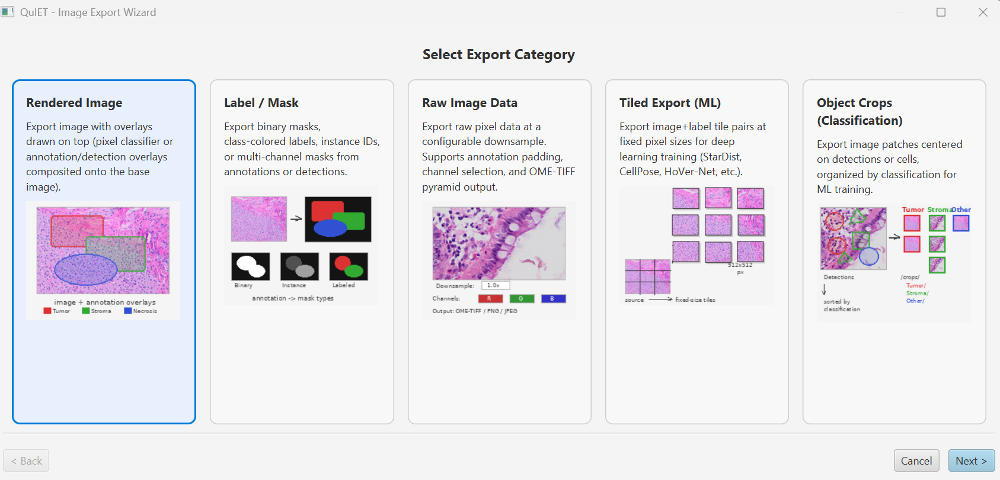
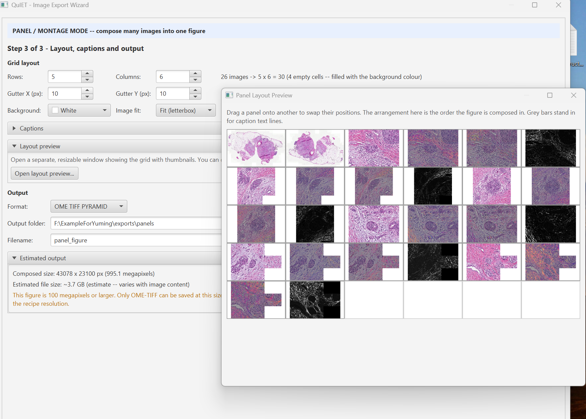

# QuIET - QuPath Image Export Toolkit

[](https://github.com/uw-loci/qupath-extension-image-export-toolkit/releases)
[](LICENSE)

A [QuPath](https://qupath.github.io/) extension that turns annotated whole-slide images into **publication-ready figures**, **review images for collaborators**, and **training datasets for machine learning** -- in batch, without writing an export script.

A guided wizard walks you from "I have an annotated project" to finished files: composite figures with scale bars and panel labels, segmentation masks for training or QC, raw pixel data at any resolution, image+label tile pairs for deep-learning frameworks, per-object crops for cell-type classifiers, and multi-image panel figures that arrange many project images into a single montage. Every export also writes a self-contained Groovy script, so the same settings can be re-run, version-controlled, or shared with a collaborator who doesn't have QuIET installed.

<!-- TODO(v1.0.0 docs): regenerate QUIET-interface.png and RenderedImageExport.png on a
     running QuPath with the v1.0.0 jar. The Step 1 category picker shows five cards
     (Rendered, Mask, Raw, Tiled, Object Crops); Panel / Montage is a separate menu
     item with its own wizard, not a card here. -->


<div align="center">

↓ &nbsp; *e.g.* &nbsp; ↓

</div>


## Requirements

- **QuPath 0.6.0** or later
- Java 21+

## Installation

1. Download the latest `qupath-extension-image-export-toolkit-*-all.jar` from [Releases](https://github.com/uw-loci/qupath-extension-image-export-toolkit/releases)
2. Drag the JAR onto the running QuPath window, **or** copy it into your QuPath `extensions/` directory
3. Restart QuPath

The extension appears under **Extensions > QuIET**, with two menu items: **Image Export...** and **Panel / Montage Export...**

> Both menu items are disabled until a project with at least one image is open.

## Quick Start

1. Open a QuPath project containing annotated images
2. Go to **Extensions > QuIET > Image Export...**
3. **Step 1** -- Choose an export category. There are **five** categories: Rendered, Mask, Raw, Tiled, and Object Crops.



4. **Step 2** -- Configure export settings (grouped into collapsible sections). A QUAREP-LiMi guidelines panel on the right provides context-sensitive recommendations based on your project's images.
5. **Step 3** -- Select images, choose output directory, review Publication Advice, and click **Export**

All five categories use this **3-step** flow. Composing a multi-image figure is a separate **Extensions > QuIET > Panel / Montage Export...** menu item with its own **3-step** flow -- see *Making a panel figure* below.

Every export also generates a **Groovy script** that you can copy, save, and re-run from QuPath's built-in script editor -- no extension required.

**Simple vs Advanced mode** -- the navigation bar has a Simple / Advanced toggle. Simple mode (the default on first run) hides rarely-used controls to reduce clutter; Advanced mode exposes every option. The toggle persists across QuPath sessions and applies to every step. If a section below seems to be missing settings, flip to Advanced.

**Making a panel figure** -- The **Panel / Montage Export...** menu item builds one combined figure from several images in your project. It opens its own wizard with a **3-step** flow: (1) select the images you want in the figure, (2) choose a *recipe* -- a recipe is the saved settings for how one image is exported, and the same recipe is applied to every image you picked -- and (3) lay out the grid (rows and columns, spacing, background colour, optional captions). QuIET renders every image the same way and tiles them into one file. You do not need to export each image separately or assemble the figure by hand in another program. See the **Panel / Montage** section below.

---

## What's new in v1.0.0

**Panel / Montage export** -- QuIET can now compose many images from your project into a single multi-panel figure. Choose your images, pick a single-image export recipe to apply to all of them, set the grid size, spacing, background colour, and optional per-image captions, and QuIET writes one montage file. See the **Panel / Montage** section below.

**Export recipes** -- A recipe is the saved settings for how one image is exported. Any panel-mode recipe configuration can now be saved to a `.json` recipe file and reloaded later -- to repeat a panel export with identical settings, or to share the look of a figure with a collaborator. Look for the **Save recipe...** and **Load recipe...** buttons on the panel recipe step.

This is QuIET's first 1.x release. It is a maturity milestone for a major new feature; **no existing settings, menus, or exports change** -- see *Migrating from v0.7.x to v1.0.0* below.

<details>
<summary><strong>Migrating from v0.7.x to v1.0.0</strong></summary>

v1.0.0 is a **fully backward-compatible** release. The version jump marks the arrival of the Panel / Montage export feature, not a breaking change.

- **Your preferences keep working.** All existing settings (export category, downsample, format, mask type, label templates, and so on) are preserved. Panel export adds new `quiet.panel.*` preferences; no existing preference key is renamed or removed.
- **Your projects are unaffected.** Panel export only reads images and metadata; it never modifies the QuPath project.
- **The existing flows are unchanged.** Rendered, Mask, Raw, Tiled, and Object Crops still run from the **Image Export...** menu item (renamed from "Export Images...") with the same 3-step wizard. Panel / Montage is added as a separate **Panel / Montage Export...** menu item with its own wizard.
- **Existing Groovy scripts still run.** Scripts generated by earlier QuIET versions are unaffected.

Simply install the v1.0.0 jar over the old one and restart QuPath.

</details>

---

<details>
<summary><h2>Publication-Quality Image Guidelines</h2></summary>

QuIET was developed in support of the community-developed checklists for publishing
images and image analyses
([Schmied et al., 2023, *Nature Methods*](https://doi.org/10.1038/s41592-023-01987-9)),
created by the [QUAREP-LiMi](https://quarep.org/) initiative. These checklists provide
consensus guidelines on image formatting, colors, annotation, and data availability
for microscopy publications.

QuIET's guidelines panel references specific checklist items from the
[QUAREP-LiMi WG12 interactive checklists](https://quarep-limi.github.io/WG12_checklists_for_image_publishing/intro.html),
organized into four categories:

- **Image Format** (ID-1 through ID-5): Cropping, borders, insets, phenotype range
- **Image Colors & Channels** (IC-1 through IC-9): Channel annotation, brightness/contrast, color-blind accessibility, grayscale panels, intensity calibration bars
- **Image Annotation** (IA-1 through IA-5): Scale bars, annotation explanation, legibility, data visibility, imaging details
- **Image Availability** (Avail-1 through Avail-3): Lossless sharing, public repositories, dedicated databases

Each guideline item in QuIET's panel shows its QUAREP checklist code (e.g., `[IC-6]`)
so users can cross-reference the full guidance at the WG12 website.

Inspiration for QuIET's approach to automated image quality guidance also comes from
Jan Brocher's [BioVoxxel Figure Tools](https://github.com/biovoxxel/BioVoxxel-Figure-Tools)
plugin for Fiji/ImageJ, which provides interactive tools for creating
publication-ready figure panels with colorblind-friendly LUT options and CDV
(color deficient vision) simulation.

QuIET integrates QUAREP-LiMi guidance at two levels:

**QUAREP Guidelines Panel (Step 2)** -- A context-sensitive panel shown alongside
the export configuration that scans your project images and provides proactive
recommendations based on the detected image types (brightfield, fluorescence,
multiplex). The panel displays relevant advice for each export category, including:

- Channel color analysis with colorblind-accessibility warnings
- Annotation/overlay color contrast recommendations
- Split-channel and display settings guidance for fluorescence
- Scale bar color and format recommendations
- Category-specific best practices (masks, tiled ML, raw, object crops)

**Publication Advice Dialog (Step 3)** -- A floating modeless dialog that checks
your specific export configuration against key QUAREP-LiMi recommendations:

- Missing scale bars on calibrated images
- Lossy JPEG compression for quantitative data
- Inconsistent display settings across compared images
- Red-green channel combinations that are not colorblind-accessible
- Multi-channel images without individual grayscale channel panels
- Missing pixel calibration for spatial reference

Each advice item identifies the specific config section to fix (e.g., "-> Scale Bar
section"). When you navigate back to Step 2, those sections are highlighted with
colored borders matching the advice severity, so you can find and fix the issue
without memorizing the advice.

All checks are advisory -- QuIET will never block an export, but helps researchers
produce clearer, more reproducible microscopy figures.

</details>

---

## Export Categories

<details>
<summary><h3>Rendered Image</h3></summary>

Produce **publication-ready figures** -- the image as it looks in QuPath, with your annotations, classifier results, or density map composited on top. Add a scale bar, panel letter (A, B, C...), per-image info stamp, and split multi-channel fluorescence into individual + merged panels in one batch. This is the export you want for papers, posters, slide decks, and figures shared for review.


| Option | Description |
|--------|-------------|
| **Classifier Overlay** | Render a pixel classifier's output on top of the image at configurable opacity |
| **Object Overlay** | Render annotation and/or detection objects with fill, outline, and name options |
| **Density Map Overlay** | Render a saved density map with a configurable colormap (Viridis, Magma, etc.) and optional color scale bar |
| **Region Type** | Export the whole image or individual annotation regions (see below) |
| **Display Settings** | Control brightness/contrast, channel visibility, and LUTs applied to the base image (see below) |
| **Scale Bar** | Optionally burn a scale bar into the exported image with configurable position and color (see below) |
| **Color Scale Bar** | For density map mode, optionally burn a color-mapped legend with min/max labels (see below) |
| **Panel Label** | Optionally add a letter label (A, B, C...) for multi-panel publication figures (see below) |
| **Info Label** | Optionally add a per-image metadata text stamp with template placeholders (see below) |
| **Split Channels** | Export multi-channel images as individual channel panels plus a merged panel, with optional grayscale/pseudocolor rendering, channel border colors, and a channel/stain legend swatch (see below) |
| **Downsample** | Resolution factor (1x = full resolution, 4x = quarter, etc.) |
| **Format** | PNG, TIFF, JPEG, OME-TIFF, OME-TIFF Pyramid, SVG |

<details>
<summary><b>Display Settings</b></summary>

By default, rendered exports apply per-image brightness/contrast and channel visibility settings -- so fluorescence images look like they do in the QuPath viewer instead of appearing as raw pixel data.

| Mode | Description |
|------|-------------|
| **Per-Image Saved Settings** (default) | Each image uses its own saved display settings from the QuPath project. If you used "Apply to similar images" in the B&C dialog, all images will already share the same settings. |
| **Current Viewer Settings** | Captures the display settings from the currently open image and applies them uniformly to all exported images. Requires an image to be open. |
| **Saved Preset** | Loads a named B&C preset saved in the project (via the Brightness & Contrast dialog's save button) and applies it to all images. |
| **Raw (No Adjustments)** | Exports raw pixel data with no display transforms. This was the only behavior prior to v0.2.1. |

</details>

<details>
<summary><b>Annotation Region Export</b></summary>

Instead of exporting the whole image, you can export individual annotation regions as separate cropped panels -- ideal for publication figures showing specific tissue features.

| Option | Values |
|--------|--------|
| **Region type** | Whole image (default), All annotations (individual) |
| **Region padding** | Pixel padding around each annotation's bounding box (default: 0) |

When "All annotations" is selected, each annotation's bounding box is exported as a separate image file, with all overlays (classifier, objects, density map, scale bar, panel label) applied to the cropped region. Padding is clamped to image bounds.

</details>

<details>
<summary><b>Scale Bar</b></summary>

Rendered exports can optionally include a burned-in scale bar with text label. The scale bar automatically picks a "nice" length (e.g., 50 um, 200 um, 1 mm) targeting roughly 15% of the image width, and formats the label with appropriate units.

| Option | Values |
|--------|--------|
| **Show scale bar** | Enable/disable (default: off) |
| **Position** | Lower Right (default), Lower Left, Upper Right, Upper Left |
| **Color** | Any hex color via color picker -- **smart default** auto-detected from project images (black for brightfield, white for fluorescence). Drawn with a luminance-based contrast outline for visibility on any background. |
| **Font size** | Auto (computed from image dimensions) or explicit size in points |
| **Bold text** | Enable/disable (default: on) |
| **Background box** | Draw a semi-transparent contrasting box behind the scale bar and label (default: off). Recommended for highly multiplexed fluorescence images where the scale bar may overlap bright signal regions. |

The scale bar color is auto-detected from your project's images when the wizard opens for the first time: brightfield-dominant projects default to black (for contrast against white tissue backgrounds), and fluorescence projects default to white (for contrast against dark backgrounds). A hint label below the color picker reminds you to choose high contrast with the image background.

The scale bar requires pixel calibration in the image metadata. If an image has no calibration, the scale bar is skipped with a warning.

> **Note:** Scale bars are only available for rendered exports. Mask, raw, and tiled exports preserve exact pixel values and must not be modified.

</details>

<details>
<summary><b>Color Scale Bar</b></summary>

For density map overlay mode, a color-mapped legend can be burned in showing the value range with min/max labels and a gradient swatch matching the selected colormap.

| Option | Values |
|--------|--------|
| **Show color scale bar** | Enable/disable (default: off) |
| **Position** | Lower Right (default), Lower Left, Upper Right, Upper Left |
| **Font size** | Auto (computed from image dimensions) or explicit size in points |
| **Bold text** | Enable/disable (default: on) |

The color scale bar is only available in density map overlay mode.

</details>

<details>
<summary><b>Panel Labels</b></summary>

Add automatic letter labels (A, B, C, ...) to exported images for multi-panel publication figures.

| Option | Values |
|--------|--------|
| **Show panel label** | Enable/disable (default: off) |
| **Label text** | Fixed text (e.g., "A") or leave blank for auto-increment (A, B, C... per image in batch) |
| **Position** | Upper Left (default), Upper Right, Lower Left, Lower Right |
| **Font size** | Auto (computed from image dimensions) or explicit size in points |
| **Bold text** | Enable/disable (default: on) |

Panel labels are drawn with a luminance-based contrast outline for visibility on any background. In batch export with auto-increment, the first image receives "A", the second "B", and so on (extending to "AA", "AB"... after "Z").

</details>

<details>
<summary><b>Info Label</b></summary>

Add a per-image metadata text stamp to exported images. The template is resolved per-image at export time, so each image gets its own metadata values.

| Option | Values |
|--------|--------|
| **Show info label** | Enable/disable (default: off) |
| **Template** | Text with `{placeholder}` tokens (see below) |
| **Position** | Lower Left (default), Lower Right, Upper Left, Upper Right |
| **Font size** | Auto (computed from image dimensions) or explicit size in points |
| **Bold text** | Enable/disable (default: off) |

**Available placeholders:**

| Placeholder | Resolves to |
|-------------|-------------|
| `{imageName}` | The project image entry name |
| `{pixelSize}` | Pixel calibration (e.g., "0.500 um/px") or "uncalibrated" |
| `{date}` | Current date (YYYY-MM-DD) |
| `{time}` | Current time (HH:MM) |
| `{classifier}` | Classifier name (empty if no classifier overlay selected) |
| `{width}` | Image width in pixels |
| `{height}` | Image height in pixels |

A **live preview** below the template field resolves the template against the currently open image and warns about empty or unrecognized placeholders. An inline placeholder reference is always visible (not hidden behind a tooltip).

</details>

<details>
<summary><b>Split Channels & Channel Legend</b></summary>

For multi-channel fluorescence images, the rendered export can emit one panel per channel plus a merged panel, which is the standard publication layout for multiplex data.

| Option | Values |
|--------|--------|
| **Split channels (individual + merge)** | Enable/disable. When on, each exported image produces one file per visible channel plus a merged file. |
| **Individual channels as grayscale** | Render each channel panel as grayscale (best intensity contrast for quantitative comparison). |
| **Individual channels in pseudocolor** | Render each channel panel in its LUT color (helps readers identify channels across multi-panel figures). |
| **Color border on channel panels** | Draw a colored border around each channel panel matching that channel's LUT color. |
| **Channel color legend swatch** | Draw a small colored rectangle with the channel name on each individual channel panel, so the channel is identifiable even in grayscale. |
| **Show channel/stain legend** | Draw a full channel/stain legend on the exported image (available for all rendered exports, not only split-channel). |

</details>

</details>

<details>
<summary><h3>Label / Mask</h3></summary>

Generate **segmentation masks paired with your images** -- the ground-truth label files needed to train or evaluate segmentation models, or to review which objects QuPath has detected. Choose binary foreground/background, integer class labels, per-object instance IDs, class-colored overlays, or one binary channel per class. Masks are rendered exactly from your annotation geometry (no JPEG, no resampling artifacts), so label values stay precise at any resolution. (Built on QuPath's `LabeledImageServer`.)

| Mask Type | Description |
|-----------|-------------|
| **Binary** | Single-class foreground/background (label 0 and 1) |
| **Grayscale Labels** | Integer label per classification (1, 2, 3, ...) with optional grayscale LUT |
| **Class-Colored** | RGB mask using each PathClass's assigned color |
| **Instance IDs** | Unique integer per object instance (16-bit), with optional label shuffling for visual clarity |
| **Multi-Channel** | One binary channel per classification |

Additional mask options:

- **Object source** -- Annotations, Detections, or Cells
- **Background label** -- Configurable background value (default 0)
- **Boundary labels** -- Enable boundary erosion with configurable label value and line thickness
- **Classification filter** -- Select/deselect which classifications to include
- **Skip images without selected classes** -- Skip exporting images that contain no objects matching any of the selected classifications. Avoids a pile of empty masks when only some images in the project have the relevant classes.
- **Format** -- PNG, TIFF, OME-TIFF, OME-TIFF Pyramid (no JPEG -- lossy compression destroys label values)

> **Note:** JPEG is intentionally excluded from mask format options because lossy compression alters pixel values, which would corrupt the integer label encoding. Masks are rendered from vector geometries at the requested downsample, so label values are always exact regardless of resolution.

</details>

<details>
<summary><h3>Raw Pixel Data</h3></summary>

Export the **underlying image pixels** -- no overlays, no brightness/contrast adjustment, no scale bar burned in -- at full resolution or downsampled. Use this when a downstream tool (an ML pipeline, a different analysis package, an archive) needs the original pixel values, optionally cropped to annotations or restricted to specific channels. Multi-resolution OME-TIFF Pyramid output is supported for very large regions.

| Option | Description |
|--------|-------------|
| **Region type** | Whole image, selected annotations, or all annotations |
| **Annotation padding** | Add pixel padding around annotation bounding boxes (clamped to image bounds) |
| **Channel selection** | Export only specific channels from multi-channel/fluorescence images |
| **OME-TIFF Pyramid** | Multi-resolution pyramidal output with configurable levels, tile size, and compression |
| **Downsample** | Resolution factor |
| **Format** | PNG, TIFF, JPEG, OME-TIFF, OME-TIFF Pyramid |

> **Note:** OME-TIFF Pyramid export uses `OMEPyramidWriter` from `qupath-extension-bioformats`. If that extension is not installed, QuIET falls back to flat OME-TIFF via `ImageWriterTools`.

</details>

<details>
<summary><h3>Tiled Export (ML Training)</h3></summary>

Generate **fixed-size image + label tile pairs** ready to feed into deep-learning training pipelines like StarDist, CellPose, or HoVer-Net. Pick a tile size, overlap, and resolution, optionally restrict tiles to annotated regions, and QuIET emits matched image and mask tiles (plus optional per-tile GeoJSON) -- replacing the custom tiling script you'd otherwise write against QuPath's `TileExporter` API.

| Option | Description |
|--------|-------------|
| **Tile size** | Width and height in pixels (e.g., 256, 512, 1024) |
| **Overlap** | Pixel overlap between adjacent tiles |
| **Downsample** | Resolution factor for tile extraction |
| **Image format** | Output format for image tiles |
| **Label masks** | Optionally generate a label mask tile alongside each image tile |
| **Label mask type** | Binary, Grayscale Labels, Instance, Colored, or Multi-Channel |
| **Parent filter** | Restrict tiles to annotation regions, TMA cores, or export all |
| **Annotated only** | Skip tiles that contain no annotated objects |
| **GeoJSON per tile** | Export object geometries for each tile |

</details>

<details>
<summary><h3>Object Crops (Classification Training)</h3></summary>

Export **one small image per detected object**, organized by class, for training a per-object classifier (cell-type calls, detection-quality filters, mitosis classifiers, etc.). Pick a fixed crop size around each cell or detection centroid, choose how classes should be encoded (subdirectory per class, or filename prefix), and QuIET produces a directory tree that drops directly into PyTorch / TensorFlow `ImageFolder`-style loaders.

| Option | Description |
|--------|-------------|
| **Object type** | Detections, Cells, or All detection objects |
| **Crop size** | Fixed output size in pixels (e.g., 64x64) |
| **Padding** | Extra pixels around the object centroid |
| **Downsample** | Resolution factor for crop extraction |
| **Label format** | Organize by subdirectory per class, or filename prefix |
| **Classification filter** | Select/deselect which classifications to export |
| **Format** | PNG, TIFF, JPEG |

Output structure depends on the label format:

- **Subdirectory**: `crops/ClassName/image_obj001.png`
- **Filename prefix**: `crops/ClassName_image_obj001.png`

</details>

<details>
<summary><h3>Panel / Montage</h3></summary>

Compose **many project images into one multi-panel figure**. Instead of exporting each image to its own file, Panel / Montage renders a set of selected images with a single shared **export recipe**, then tiles them into one rows-by-columns montage with controllable spacing, an optional per-image caption, and a chosen background colour. This is the export for a figure that compares conditions, timepoints, or samples side by side -- replacing the manual "export each image, then assemble in Illustrator or ImageJ" step.

> A **recipe** is the saved settings for how one image is exported. In panel mode you choose the recipe once, and QuIET applies it to every image in the figure so all panels are rendered the same way.

Panel / Montage has its own menu item -- **Extensions > QuIET > Panel / Montage Export...** -- which opens a dedicated wizard with a **3-step** flow:

1. **Step 1 -- Select images.** Choose which project images go into the figure. Image selection comes *before* the layout on purpose -- the grid size is suggested from how many images you pick.
2. **Step 2 -- Recipe.** Choose how a single image should be exported. The recipe can be any of QuIET's single-image categories (Rendered, Raw, Mask); the same recipe is applied to every image. You can accept the pre-filled settings and continue, or adjust them. Optionally **Save recipe...** to a `.json` file, or **Load recipe...** to reuse one.
3. **Step 3 -- Layout, captions and output.** Set the grid (rows x columns), the gutter spacing, the background colour, the cell-fit mode and optional captions, then choose the output format and export. Click **Open layout preview...** for a separate, resizable, always-on-top window that shows the montage with thumbnails -- drag any image onto another to swap their positions and rearrange the figure.



The first time you open Panel / Montage Export, a short one-time introduction explains how recipes work; you can dismiss it permanently with "Do not show this message again."

<details>
<summary><strong>Getting started</strong> (read this first)</summary>

**What panel export does** -- Panel / Montage produces *one* combined montage figure from *many* project images, instead of one file per image. It never modifies your QuPath project; it only reads images and metadata.

**Prerequisites** -- an open QuPath project with at least two images, and the images you want in the figure already present in that project.

**First run** -- open **Extensions > QuIET > Panel / Montage Export...** and follow the step order: pick images, then choose a recipe, then set the grid. The grid controls (rows and columns) only appear on Step 3, after images are selected -- this is deliberate, not a bug. QuIET seeds the grid to a near-square layout for your image count, which you can then adjust.

QuIET's panel/montage layout follows conventions established by figure-assembly tools for microscopy: Jan Brocher's [BioVoxxel Figure Tools](https://github.com/biovoxxel/BioVoxxel-Figure-Tools), [QuickFigures](https://github.com/grishkam/QuickFigures), and ImageJ's built-in *Make Montage* command -- a rows-by-columns grid with spacing between cells, uniform cell sizing, and optional per-image labels. QuIET deliberately differs in two ways: it exposes independent horizontal and vertical gutters in pixels (finer control than a single fractional border), and it builds each panel from a live QuIET export recipe rather than from pre-exported static images.

</details>

<details>
<summary><strong>Common tasks</strong></summary>

**Compose a figure from project images** -- open Panel / Montage, filter and check the images you want, pick or load a recipe, set rows x columns, set the X/Y gutter and background colour, review the size estimate, choose an output format, and Export. The result is one montage file in `exports/panels/`.

**Save and reuse an export recipe** -- a recipe is the saved settings for how one image is exported, stored as a `.json` file. Configure the recipe on Step 2, then click **Save recipe...** to write the `.json`; later, click **Load recipe...** in panel mode to apply it again. You do **not** need a recipe file to make a panel -- without one, the recipe step pre-fills from your last-used settings. Save/Load is the reuse and reproducibility path.

**Add captions to each panel** -- turn on the filename caption, choose whether it sits **Above** or **Below** the image, optionally check metadata fields to print (each renders on its own line), and set the caption font size and colour. Captions are drawn in the gutter band against the panel background colour. These are a **Caption** -- distinct from the in-image **Info Label** and **Panel Label** features on the Rendered category.

**Filter a large project down to the right images** -- on Step 1, use the **Filter images** section: filter by name, by image type, and by metadata field/value to narrow the list, then check the specific images you want. The live "X selected" count confirms how many will be used. Panels fill the grid in the order images appear in this list (row-major: left to right, top to bottom).

</details>

<details>
<summary><strong>Advanced features</strong></summary>

**Output format and the 100-megapixel rule** -- The composed figure can be written as PNG, TIFF, JPEG, OME-TIFF, OME-TIFF Pyramid, or SVG. Figures **at or above 100 megapixels** are restricted to **OME-TIFF** output -- it streams to disk and does not need the whole figure in memory at once. When the figure crosses 100 MP the format combo rebuilds live and an amber notice explains why. SVG keeps a soft warning above 16 megapixels (a confirmation prompt at export, not a hard cap).

**Recipe categories** -- The Step 2 recipe can be Rendered, Raw, or Mask -- the single-image categories that produce exactly one image per source image. Object Crops is not offered (it produces many crops per image), Tiled is not offered (it produces many tiles per image), and Panel is not offered (no panels-of-panels). The recipe category's own format restrictions still apply: a recipe that forbids JPEG (a Mask, or real fluorescence Raw data) forbids JPEG for the panel output too.

**Layout preview** -- The **Open layout preview...** button on Step 3 opens a separate, resizable, always-on-top window showing the composed grid with image thumbnails, the real gutters and background colour, and caption placeholders drawn as horizontal bars. It updates live as you change the grid, gutters, background, cell-fit mode or captions. **Drag any image cell onto another to swap them** -- the arrangement in the preview is the order the figure is composed in. The window stays open beside the wizard so you can adjust settings and watch the result; its always-on-top is lifted automatically while an export runs so progress and result dialogs stay visible.

**Cell-fit mode** -- The **Cell fit** control on Step 3 decides how each image is fitted into its grid cell. All three modes **preserve the image aspect ratio** -- no mode distorts an image:

| Cell fit mode | Behaviour |
|---------------|-----------|
| **Fit (letterbox)** (default) | Scale the image to fit fully inside the cell; fill the leftover space with the background colour. Nothing is cropped. |
| **Fill (crop)** | Scale the image to completely cover the cell; crop the overflow. Nothing is padded. |
| **Actual size** | Place the image at its native pixel size, centred in the cell; pad with background if smaller, crop if larger. |

**Reading the size estimate** -- Step 3 shows the composed pixel dimensions (from grid x cell size x gutters) and a rough output file-size estimate. The file-size figure is an estimate and varies with image content.

**The generated Groovy script** -- panel mode, like every QuIET category, emits a self-contained script. The panel script holds all cells in memory while composing.

</details>

<details>
<summary><strong>Settings and preferences</strong></summary>

All panel settings persist across QuPath sessions, like every other QuIET setting. The keys live under the `quiet.panel.*` namespace in QuPath's standard preference system.

| Preference key | What it controls |
|----------------|------------------|
| `quiet.panel.rows` | Number of grid rows |
| `quiet.panel.columns` | Number of grid columns |
| `quiet.panel.gutterX` | Horizontal spacing between cells (and at the left/right edges), pixels |
| `quiet.panel.gutterY` | Vertical spacing between cells (and at the top/bottom edges), pixels |
| `quiet.panel.backgroundColor` | Panel background and gutter colour |
| `quiet.panel.cellFitMode` | How images are fitted into cells (Fit / Fill / Actual size) |
| `quiet.panel.showFilenameCaption` | Whether the per-image filename caption is drawn |
| `quiet.panel.captionPosition` | Caption band above or below the image |
| `quiet.panel.metadataFields` | Which metadata fields to print, one line each |
| `quiet.panel.captionFontSize` | Caption font size |
| `quiet.panel.captionColor` | Caption text colour |
| `quiet.panel.format` | Output format for the composed figure |
| `quiet.panel.recipeCategory` | Last-used single-image recipe category |

</details>

<details>
<summary><strong>Troubleshooting</strong></summary>

- **"This figure is 100 megapixels or larger"** -- the composed figure is at or above 100 MP, so standard PNG/TIFF/JPEG/SVG output is disabled. Fix: switch the output format to OME-TIFF, or reduce the grid size, the gutters, or the recipe resolution so the figure is under 100 MP.
- **"The figure is too large to compose in memory"** -- the whole figure is built as one in-memory image and a very large figure can exhaust QuPath's memory. Fix: reduce the figure size (fewer cells, higher recipe downsample), use OME-TIFF, or raise QuPath's memory limit (`-Xmx` launch option).
- **"This recipe file could not be read"** -- the selected `.json` is not a valid QuIET recipe, is from a newer QuIET version, or has been hand-edited into an invalid state. The panel recipe is left unchanged. Fix: re-create the recipe with **Save recipe...**; do not hand-edit recipe files.
- **JPEG is not available for the panel** -- the recipe is a Mask, or the images are real fluorescence / raw multi-channel data; lossy JPEG would corrupt the values, so QuIET excludes it (the same rule as the single-image categories). Fix: choose PNG, TIFF, or OME-TIFF.
- **Grid controls are missing** -- rows and columns appear only on Step 3, after at least one image is selected on Step 1. Fix: select images first, then advance.
- **Some images are missing from the panel** -- they may be filtered out (check the name/type/metadata filters on Step 1) or unchecked in the list; the panel uses only checked images. The "X selected" count confirms how many will be used.

</details>

| Option | Description |
|--------|-------------|
| **Select images** (Step 1) | The project images included in the figure. Filter by name, type, and metadata; check the images you want. |
| **Recipe** (Step 2) | A single-image export recipe (Rendered, Raw, or Mask) applied to every image. Load/Save as `.json`. |
| **Layout preview** (Step 3) | Separate always-on-top window: visual grid with thumbnails; drag images to swap/rearrange. |
| **Rows / Columns** | Grid dimensions; seeded near-square from the image count |
| **Gutter X / Gutter Y** | Horizontal and vertical spacing between cells, in pixels |
| **Background** | Background colour of the figure and the gutters / caption bands |
| **Cell fit** | Fit (letterbox), Fill (crop), or Actual size -- aspect ratio always preserved |
| **Captions** | Optional per-image filename caption plus metadata lines, drawn above or below each panel |
| **Format** | PNG, TIFF, JPEG, OME-TIFF, OME-TIFF Pyramid, SVG -- restricted to OME-TIFF at or above 100 megapixels |

</details>

<details>
<summary><h3>GeoJSON & Metadata Sidecars</h3></summary>

**GeoJSON Export** -- An orthogonal option available alongside any export category. When enabled, QuIET exports all annotations and detections as a `.geojson` file per image -- useful for COCO/YOLO-style training pipelines that need geometry alongside image data. Enable via the **"Also export GeoJSON annotations"** checkbox on the image selection step.

**Metadata Sidecar Files** -- Every batch export automatically generates a human-readable `.txt` metadata file alongside the exported images. These files provide essential context for interpreting exports later, especially when shared with collaborators or loaded into external tools.

**Mask exports** produce `mask_legend.txt` containing:
- Label-to-class mapping (e.g., `1 = Tumor`, `2 = Stroma` for grayscale labels)
- Mask type, object source, boundary settings
- Pixel size after downsampling

**Rendered, raw, and tiled exports** produce `export_info.txt` containing:
- Channel names and colors (fluorescence) or stain vectors (brightfield H&E/H-DAB)
- Display settings applied during rendering (if applicable)
- Pixel size with downsample factor
- Tile size and overlap (for tiled exports)

Images with different channel configurations are automatically grouped in the metadata file. Metadata writing never interrupts the export -- failures are logged but silently ignored.

</details>

---

<details>
<summary><h2>Script Generation</h2></summary>

Every export produces a **self-contained Groovy script** that:

- Runs standalone in QuPath's script editor (no extension dependencies)
- Contains all configuration as editable variables at the top
- Processes all project images in a batch loop
- Reports progress and error counts
- Can be saved, version-controlled, and shared

Use the **Copy Script** or **Save Script...** buttons in the wizard to capture the generated script before or after running an export.

</details>

<details>
<summary><h2>Output Structure</h2></summary>

Exports are written to a configurable output directory. The default structure under a QuPath project is:

```
<project>/
  exports/
    rendered/                # Rendered image exports
      image_001.png
      export_info.txt        # Channel info, display settings, pixel size
    masks/                   # Label/mask exports
      image_001.png
      mask_legend.txt        # Label-to-class mapping, pixel size
    raw/                     # Raw pixel data exports
      image_001.tif
      export_info.txt        # Channel info, pixel size
    tiles/                   # Tiled ML exports
      <image_name>/
        <image_name>_[x,y,w,h].tif
        <image_name>_[x,y,w,h].png   (label)
      export_info.txt        # Channel info, tile params, pixel size
    crops/                   # Object crop exports
      <ClassName>/
        <image_name>_obj001.png
    panels/                  # Panel / Montage composed figures
      panel_figure.png
```

Filenames are sanitized using QuPath's `GeneralTools.stripInvalidFilenameChars()` for cross-platform compatibility.

</details>

<details>
<summary><h2>Preferences</h2></summary>

All wizard settings are automatically persisted across QuPath sessions. When you reopen the export wizard, your previous configuration (mask type, downsample, format, padding, etc.) is restored.

Preferences are stored in QuPath's standard preference system under the `quiet.*` namespace.

</details>

<details>
<summary><h2>Building from Source</h2></summary>

```bash
# Clone the repository
git clone https://github.com/uw-loci/qupath-extension-image-export-toolkit.git
cd qupath-extension-image-export-toolkit

# Build the extension JAR (includes all dependencies)
./gradlew shadowJar

# The JAR is at: build/libs/qupath-extension-image-export-toolkit-*-all.jar
```

### Other Gradle Tasks

```bash
# Run all tests
./gradlew test

# Compile only (quick check)
./gradlew compileJava

# Clean build artifacts
./gradlew clean
```

### Project Structure

```
src/main/java/qupath/ext/quiet/
  QuietExtension.java              # Extension entry point
  advice/
    AdviceItem.java                # Single advice result (severity, title, config section ref)
    AdviceSeverity.java            # ERROR, WARNING, INFO
    ImageContext.java              # Per-image metadata for advice checks
    PublicationAdviceChecker.java  # QUAREP-LiMi guideline checks
  export/                          # Export logic + script generation
    ExportCategory.java            # RENDERED, MASK, RAW, TILED, OBJECT_CROPS, PANEL
    OutputFormat.java              # PNG, TIFF, JPEG, OME_TIFF, OME_TIFF_PYRAMID, SVG
    RenderedExportConfig.java      # Rendered export configuration with sub-config records
    RenderedImageExporter.java     # Rendered export logic
    MaskExportConfig.java          # Mask/label export configuration (rejects JPEG)
    MaskImageExporter.java         # LabeledImageServer-based mask export
    RawExportConfig.java           # Raw pixel export configuration
    RawImageExporter.java          # Raw pixel export logic
    TiledExportConfig.java         # Tiled ML export configuration
    TiledImageExporter.java        # TileExporter-based tiled export
    ObjectCropConfig.java          # Object crop export configuration
    ObjectCropExporter.java        # Per-object crop export logic
    PanelExportConfig.java         # Panel / Montage export configuration
    CellFitMode.java               # FIT_LETTERBOX, FILL_CROP, ACTUAL_SIZE (aspect preserved)
    ExportRecipe.java              # Gson-serialised .json single-image recipe (load/save)
    PanelComposer.java             # Grid composition: background, gutters, cell-fit, captions
    CaptionRenderer.java           # Multi-line gutter caption renderer (panel mode)
    PanelImageExporter.java        # Renders each image via the recipe, composes once, writes once
    GeoJsonExporter.java           # GeoJSON annotation export
    BatchExportTask.java           # JavaFX Task for background batch processing
    ExportResult.java              # Export outcome tracking
    ScaleBarRenderer.java          # Java2D scale bar with background box support
    ColorScaleBarRenderer.java     # Color-mapped legend for density maps
    PanelLabelRenderer.java        # Panel letter label renderer (A, B, C...)
    InfoLabelRenderer.java         # Per-image metadata text stamp renderer
    InsetRenderer.java             # Magnified-inset / detail-panel renderer (Java2D utility)
    TextRenderUtils.java           # Shared text rendering (outlined text, font sizing)
    ExportMetadataWriter.java      # Metadata sidecar file writer
    GlobalDisplayRangeScanner.java # Global min/max display range computation
    ScriptGenerator.java           # Script generation dispatcher
    RenderedScriptGenerator.java   # Groovy script for rendered export
    MaskScriptGenerator.java       # Groovy script for mask export
    RawScriptGenerator.java        # Groovy script for raw export
    TiledScriptGenerator.java      # Groovy script for tiled export
    ObjectCropScriptGenerator.java # Groovy script for object crop export
    PanelScriptGenerator.java      # Groovy script for panel / montage export
  ui/
    ExportWizard.java              # Main wizard window (Simple/Advanced mode toggle)
    CategorySelectionPane.java     # Step 1: category cards (FlowPane, 6 cards)
    SectionBuilder.java            # Collapsible TitledPane section factory
    RenderedConfigPane.java        # Step 2a: rendered options (smart defaults, live preview)
    MaskConfigPane.java            # Step 2b: mask options (no JPEG)
    RawConfigPane.java             # Step 2c: raw options
    TiledConfigPane.java           # Step 2d: tiled options
    ObjectCropConfigPane.java      # Step 2e: object crop options
    PanelRecipePane.java           # Panel Step 3: recipe category + embedded config + load/save
    PanelLayoutPane.java           # Panel layout step: grid, gutters, background, cell-fit, captions, output
    ImageSelectionPane.java        # Step 3: image list + run + advice button (Step 2 in panel mode)
    ImageEntryItem.java            # Wrapper for ProjectImageEntry in the image selection list
    GuidelinesPane.java            # QUAREP-LiMi context-sensitive guidelines (Step 2 right panel)
    PublicationAdvicePane.java     # Floating advice dialog with section references
  preferences/
    QuietPreferences.java          # Persistent preference storage

src/main/resources/
  qupath/ext/quiet/ui/
    strings.properties             # All UI strings (i18n-ready)
  META-INF/services/
    qupath.lib.gui.extensions.QuPathExtension
```

</details>

<details>
<summary><h2>Known Limitations</h2></summary>

- **OME-TIFF Pyramid** requires `qupath-extension-bioformats` to be installed alongside QuIET. Without it, pyramid exports fall back to flat OME-TIFF.
- **SVG export** uses the JFreeSVG library for vector rendering. The base image is embedded as a raster element; annotations and overlays are rendered as vector paths. SVG is only available for rendered exports.
- **Channel selection** currently uses channel indices. The UI populates available channels, but auto-detection from image metadata is planned for a future release.
- **Tiled GeoJSON** produces one GeoJSON file per tile via QuPath's `TileExporter.exportJson()` API (not a single consolidated file).
- Rendered export with classifier overlay requires a pixel classifier saved in the QuPath project.
- Density map overlay requires a density map saved in the QuPath project (created via **Analyze > Density maps**).
- **Display Settings** "Current Viewer" mode requires an image to be open in the viewer at export time. "Saved Preset" mode requires presets saved via QuPath's Brightness & Contrast dialog.
- **Panel / Montage** composes the whole figure as one in-memory image. Figures at or above 100 megapixels are restricted to OME-TIFF output; very large panels may still need a higher QuPath memory limit (`-Xmx`). See Troubleshooting in the Panel / Montage section.
- **Panel / Montage** fills cells in the order images appear in the Step 2 selection list (row-major, left to right, top to bottom). Drag-to-reorder is planned for a future release.
- A panel **export recipe** is a saved `.json` file. A recipe file that has been hand-edited into an invalid state is rejected with an error rather than silently corrected.

</details>

<details>
<summary><h2>Roadmap</h2></summary>

Future releases may include:

- Inset / zoom panels exposed in the UI (the `InsetRenderer` primitive exists in code but is not yet wired into any config pane)
- Drag-to-reorder panel cells (cells currently fill the grid in image-selection-list order)
- Per-panel letter labels (A, B, C) on the composed figure
- Contour/outline mask export
- Stain deconvolution channel export
- COCO/YOLO annotation format export

**Recently implemented** (now available):

- ~~Multi-panel grid / figure layout composition~~ -- compose many project images into one montage figure (v1.0.0)
- ~~Export recipes~~ -- save and reload single-image export settings as a `.json` recipe (v1.0.0)
- ~~Split-channel export~~ -- individual fluorescence channels + merge (v0.6.0)
- ~~Display range matching~~ -- global matched display settings across batch images (v0.6.0)
- ~~DPI / resolution control~~ -- target DPI mode for journal requirements (v0.7.0)
- ~~Dimension / timestamp labels~~ -- info label with template placeholders (v0.7.0)
- ~~Scale bar smart defaults~~ -- auto-detect color from project images (v0.7.3)
- ~~QUAREP guidelines panel~~ -- context-sensitive publication advice on Step 2 (v0.7.3)
- ~~Publication Advice floating dialog~~ -- with section highlighting on Step 2 (v0.7.3)
- ~~Channel / stain legend overlay~~ -- optional color legend on rendered exports, plus per-panel color swatches for split-channel
- ~~Skip empty mask images~~ -- omit mask output for images that have no objects in the selected classes
- ~~Simple / Advanced UI mode~~ -- single-click toggle to hide or reveal rarely-used controls across every step

See `documentation/POTENTIAL_FEATURES.md` for detailed implementation plans.

</details>

---

## Support

For general support and feature requests, please post on the [image.sc forum](https://forum.image.sc/) with the `#qupath` tag and mention `@Mike_Nelson` to flag the topic for my attention.

## License

This project is licensed under the Apache License 2.0 - see the [LICENSE](LICENSE) file for details.

## Acknowledgments

Built on top of [QuPath](https://qupath.github.io/), an open-source platform for bioimage analysis. QuIET leverages QuPath's `LabeledImageServer`, `TileExporter`, `TransformedServerBuilder`, and `ImageWriterTools` APIs.

## AI-Assisted Development

This project was developed with assistance from [Claude](https://claude.ai) (Anthropic). Claude was used as a development tool for code generation, architecture design, debugging, and documentation throughout the project.
